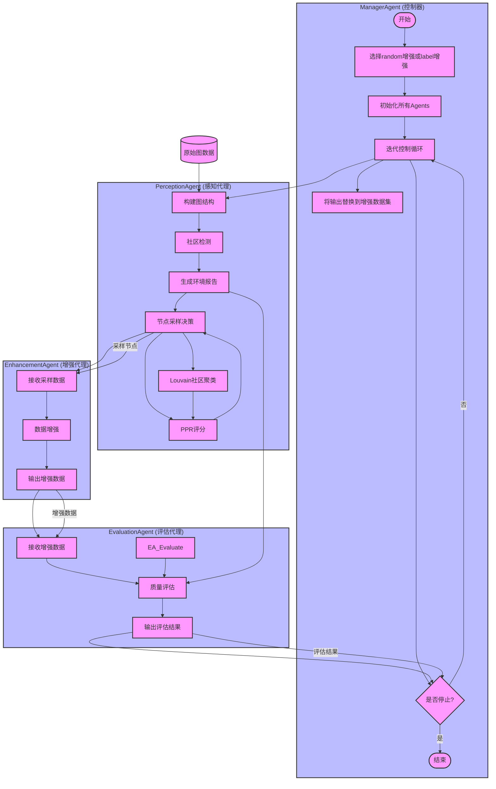

# Leveraging Large Language Models for Agent-Based Graph Data Synthesis

## Overview



```text
LLM4GDA/
├── enhancement_agent.py         # 图数据增强Agent，负责图数据增强的操作
├── evaluation_agent.py          # 图数据增强结果评估Agent，负责评估增强后的图数据效果
├── main.py                      # 主代码，程序入口，控制整个流程的执行
│   └── 功能说明：
│       - 通过命令行参数选择图数据增强模式
│       - `--enhancement_mode` 参数：
│           - `random`：执行随机相同社区数据增强，调用 `enhancement_agent.py`。
│           - `label`：执行标签增强并使用 `few-shot` 数据增强，调用 `enhancement_agent.py` 和 `tricks/few_shot.py`。
│       - 基于选择的增强模式，调用不同的 Agent 执行相应的数据增强任务。
├── manager_agent.py             # 管理员Agent，管理不同Agent的执行和调度
├── perception_agent.py          # 图数据感知Agent，负责感知图数据的特征和变化

├── data/                        # 数据文件夹
│   ├── cora.json                # 原数据集，Cora数据集
│   ├── cora_enhancement.json    # 基础增强后的数据集
│   ├── cora_label_5_5.json      # 标签为5的节点中，将其mask为Train的节点随机采样到5的增强数据集
│   ├── cora_label_5_10.json     # 标签为5的节点中，将其mask为Train的节点随机采样到10的增强数据集
│   └── cora_label_5_5_enhancement.json  # 对cora_label_5_5.json进行few-shot增强后的数据集

├── log/                         # 日志文件夹
│   ├── log_main/                # 记录代码运行时的状态和输入输出
│   └── log_result/              # 记录增强后的数据集和实验结果

├── tricks/                      # 实现不同功能的辅助脚本
│   ├── data_sample.py           # 随机挑选社区节点的功能
│   ├── few_shot.py              # 生成few-shot增强数据集的功能
│   ├── generate_data_clear.py   # 对生成的数据进行格式清洗
│   ├── test.py                  # 测试代码，验证增强效果
│   └── transfer_texts.py        # 将原数据集的text属性进行提炼和压缩

├── Vertification/               # 验证代码，验证生成数据在GNN训练中的效果
│   ├── data/                    # 存放训练数据集
│   ├── models/                  # 存放GNN模型
│   ├── train.py                 # 用原数据集（features为初始文本向量）进行训练
│   └── train_llm.py             # 用语言模型提取text生成初始向量进行训练

```


## Usage

```
pip install -r requirements.txt
```


```
python main.py
```

